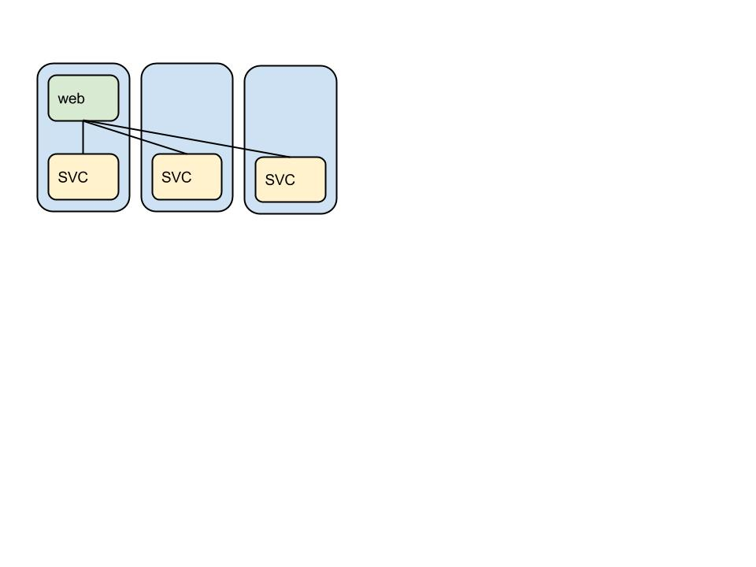
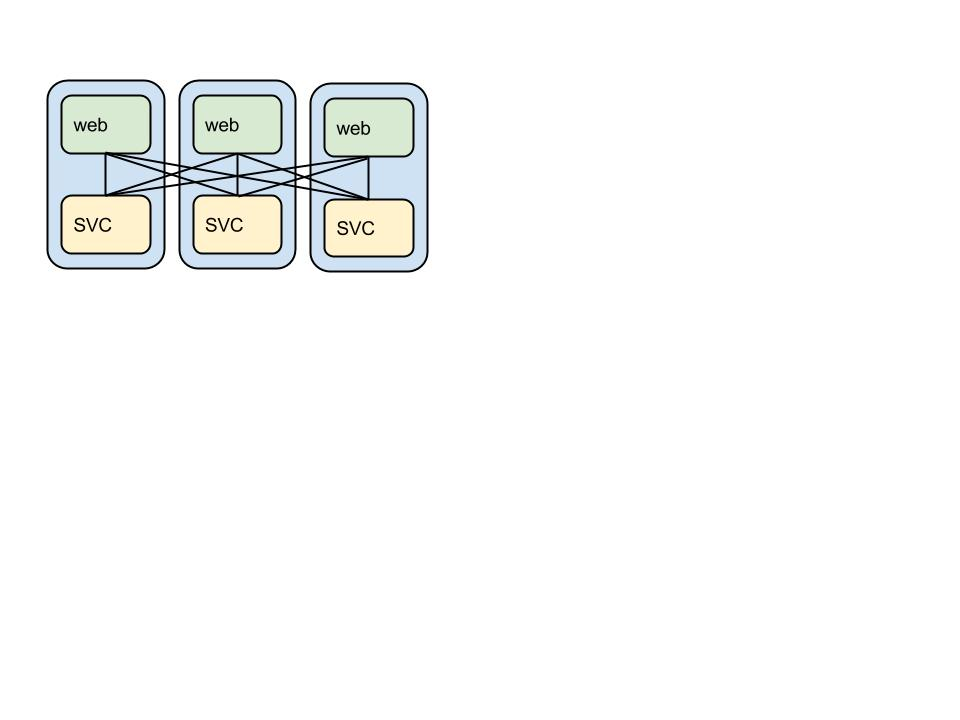

Hello World webserver Cluster
--------------

##### TASK
Repeat the setup steps from core-01 on core-02 and core-03 and just for completeness run and verify the webserver from the previous step.

** another fun fact. I'm writing this workshop on my home network which is experiencing stability problems. During the build on core-02 the network crashed and the build stopped. I simply restarted the build and it resumed from where it had left off. (a) no fuss or muss (b) no worries if it was complete or not.

```kill``` the container currently running on core-01.

##### TASK
```
mkdir -p ${HOME}/src/github.com/rbucker
cd ${HOME}/src/github.com/rbucker
git clone https://github.com/rbucker/cododemo
cd cododemo
```

Fleet
-----
"CoreOS aggregates individual machines into a single pool of resources. Instead of running a service on a specific machine, services are submitted to the cluster and the cluster manager, fleet, decides where they should run. Fleet allows you to gracefully update CoreOS across your cluster, handles machine failures automatically and allows for efficient resource utilization." - [Full Article](https://coreos.com/docs/)

With fleet, you can treat your CoreOS cluster as if it shared a single init system. It encourages users to write applications as small, ephemeral units that can easily migrate around a cluster of self-updating CoreOS machines. - [Full Article](https://coreos.com/using-coreos/clustering/)

** fleetctl is similar to systemctl (from systemd). systemd operates on a sindle node where fleet operates on cluster.

Sample Unit Service files:
--------------------------

- [nginx.service](https://github.com/rbucker/cododemo/blob/master/nginx.service)

```
[Unit]
Description=nginx

[Service]
EnvironmentFile=/etc/environment
Restart=always
RestartSec=10s
ExecStartPre=/usr/bin/docker pull marceldegraaf/nginx
ExecStart=/usr/bin/docker run --rm --name nginx -p 80:80 -e HOST_IP=${COREOS_PUBLIC_IPV4} marceldegraaf/nginx
ExecStop=/usr/bin/docker kill nginx

[X-Fleet]
X-Conflicts=nginx.service
```

- [Dockerfile](https://github.com/marceldegraaf/blog-coreos-1/blob/master/nginx/Dockerfile)

```
FROM stackbrew/ubuntu:saucy
MAINTAINER Marcel de Graaf <mail@marceldegraaf.net>

# Install Nginx
RUN apt-get install -y --force-yes software-properties-common
RUN add-apt-repository ppa:nginx/stable
RUN apt-get update
RUN apt-get install -y --force-yes nginx curl

# Install confd
RUN curl -L https://github.com/kelseyhightower/confd/releases/download/v0.3.0/confd_0.3.0_linux_amd64.tar.gz | tar xz
RUN mv confd /usr/local/bin/confd

# Create directories
RUN mkdir -p /etc/confd/conf.d
RUN mkdir -p /etc/confd/templates

# Add confd files
ADD ./nginx.conf.tmpl /etc/confd/templates/nginx.conf.tmpl
ADD ./nginx.toml /etc/confd/conf.d/nginx.toml

# Remove default site
RUN rm -f /etc/nginx/sites-enabled/default

# Add boot script
ADD ./boot.sh /opt/boot.sh
RUN chmod +x /opt/boot.sh

# Run the boot script
CMD /opt/boot.sh
```

- [boot.sh](https://github.com/marceldegraaf/blog-coreos-1/blob/master/nginx/boot.sh)

```
#!/bin/bash

# Fail hard and fast
set -eo pipefail

export ETCD_PORT=${ETCD_PORT:-4001}
export HOST_IP=${HOST_IP:-172.17.42.1}
export ETCD=$HOST_IP:4001

echo "[nginx] booting container. ETCD: $ETCD"

# Loop until confd has updated the nginx config
until confd -onetime -node $ETCD -config-file /etc/confd/conf.d/nginx.toml; do
  echo "[nginx] waiting for confd to refresh nginx.conf"
  sleep 5
done

# Run confd in the background to watch the upstream servers
confd -interval 10 -node $ETCD -config-file /etc/confd/conf.d/nginx.toml &
echo "[nginx] confd is listening for changes on etcd..."

# Start nginx
echo "[nginx] starting nginx service..."
service nginx start

# Tail all nginx log files
tail -f /var/log/nginx/*.log
```

- [nginx.toml](https://github.com/marceldegraaf/blog-coreos-1/blob/master/nginx/nginx.toml)
 
```
[template]
keys        = [ "app/server" ]
owner       = "nginx"
mode        = "0644"
src         = "nginx.conf.tmpl"
dest        = "/etc/nginx/sites-enabled/app.conf"
check_cmd   = "/usr/sbin/nginx -t -c /etc/nginx/nginx.conf"
reload_cmd  = "/usr/sbin/service nginx reload"
```

- [nginx.conf.tmpl](https://github.com/marceldegraaf/blog-coreos-1/blob/master/nginx/nginx.conf.tmpl)

```
upstream app {
  {{ range $server := .app_server }}
  server {{ $server.Value }};
  {{ end }}
}

server {
  server_name _;

  location / {
    proxy_pass http://app;
    proxy_redirect off;
    proxy_set_header Host $host;
    proxy_set_header X-Real-IP $remote_addr;
    proxy_set_header X-Forwarded-For $proxy_add_x_forwarded_for;
  }
}
```


- [Web@.service](https://github.com/rbucker/cododemo/blob/master/web%40.service)

You can add additional criteria to the ```X-Fleet``` section ... "one fleet controls all clusters"
```
[X-Fleet]
X-Conflicts=webapp*
X-ConditionMachineMetadata=provider=rackspace
X-ConditionMachineMetadata=platform=cloud
X-ConditionMachineMetadata=region=east
```


Get a list of the machines in the cluster

##### TASK
```
fleetctl list-machines
```

Load the service file into fleet

##### TASK
```
fleetctl list-unit-files
fleetctl submit web@.service
fleetctl list-unit-files
fleetctl list-units
```

Start the units (it's going to take a while)

##### TASK
```
fleetctl start web@{8081..8083}.service
```

And then you can test the status

##### TASK
```
fleetctl list-unit-files
fleetctl list-units
```

Get the port number (the ip address and the port number may not match)

##### TASK
```
docker ps
```

then in a browser

##### TASK
```
http://<ipaddr>/bar
```


HA Hello World webserver
--------------

[Link](https://github.com/marceldegraaf/blog-coreos-1/tree/master/nginx) to nginx container project

##### TASK
```
fleetctl submit nginx.service
fleetctl start nginx.service
```

Get the IP for the instance

##### TASK
```
grep COREOS_PUBLIC_IPV4 /etc/environment | awk 'BEGIN{FS = "="} {print $2}'
```

then in a browser (notice port 80 by default)

##### TASK
```
http://<ipaddr>/bar
```

** reload a few times and watch the ID

[docs](https://coreos.com/docs/launching-containers/launching/launching-containers-fleet/)


One interesting side note... while this example has a confd implementation linked to the nginx container there is some overhead there. It would be interesting to check the size and resource consumption agains a small curl or url request code that [waits for a change](https://coreos.com/docs/distributed-configuration/etcd-api/#waiting-for-a-change) and then makes the necessary changes to the config etc.


Logging
-------

It would be great to execut ALL of these commands from the same or any system. Try each one. What do you suppose is the issue?

##### TASK
```
fleetctl journal -f web@8081.service
fleetctl journal -f web@8082.service
fleetctl journal -f web@8083.service
fleetctl journal -f nginx.service
```

How would you correct this problem?


Hello World cloud-config
------------------------

tbd

What is a sidekick app?
-----------------------

In this example the nginx instance (1) watches etcd, (2) reconstructs the nginx config with the changes, (3) restarts nginx. Much of this is triggered by fleet and the nginx container. In the case of a sidekick, there would be a special container that is linked to the main app in separate fleet unit files. Then when the sidekick determined that an efent was occuring it would notify some other service (including etcd) that a change had ocurred; and thus the change would be reflected upstream.

Just as in this example. "sidekick" is a different, yet idiomatic, way to perform the same function.

Ooops
-----

```
fleetctl destroy web@{8081..8083}.service
fleetctl start web@{8081..8083}.service
fleetctl list-units
```

now reload the webpage. what happened?

```
fleetctl destroy nginx.service
fleetctl start nginx.service
fleetctl list-units
```

reload the browser. What happened?

Finally
-------

This example looks like:



What changes are necessary to create:




NOT CONFIRMED
-------------

```
From your workstation/laptop/etc, do the following ....

ssh-keygen -t rsa
 - you may accept all default without passphrase

ssh-copy-id -i ~/.ssh/id_rsa.pub core@<ip>
 - do this to all your coreos clusters

eval `ssh-agent`

ssh-add ~/.ssh/id_rsa
 - add you ssh private key

copy the ~/.ssh/know_hosts to ~/.fleetctl/
 - you check about this things but basically these are the machines that you ssh-in

fleetctl --tunnel=<one of your clusters> list-units -l
 - you may use the env vars (FLEECTL_TUNNEL=<ip of one of your clusters>) of fleet for the tunnel and remove the --tunnel when executing fleetctl

```

Cluster Monitoring
-----------------

[Heapster](https://github.com/GoogleCloudPlatform/heapster) (the docs seem to favor kubernetes so I have not started looking into this one)

Cluster 
-------

We could have deployed a [kubernetes cluster](https://github.com/GoogleCloudPlatform/kubernetes/blob/master/docs/getting-started-guides/vagrant.md) same as we did CoreOS. It created 3 nodes ... my only concern is that this project uses fedora 20. While nice for the ecosystem I'd prefer to use vagrant+coreos+kubernetes and the example coreos docs want vmware. 

[kubernetes](https://github.com/GoogleCloudPlatform/kubernetes)


[return](https://github.com/rbucker/cododemo/blob/master/README.md)
